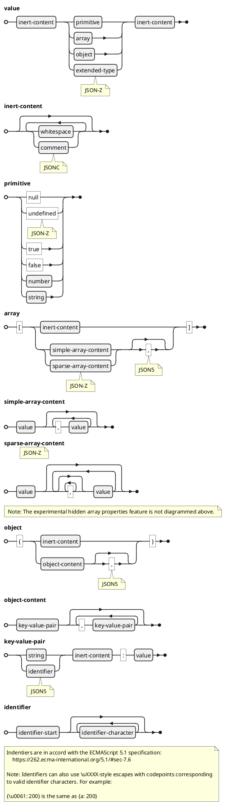
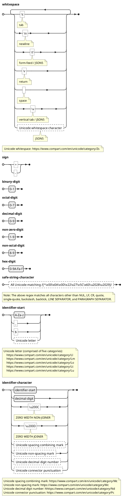
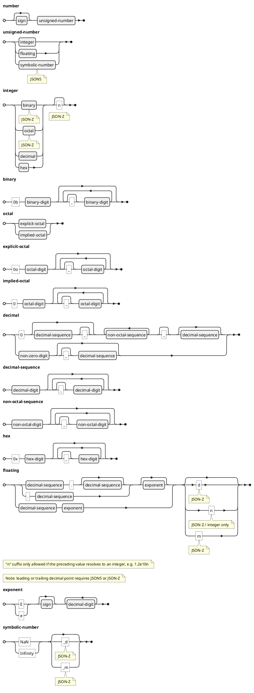
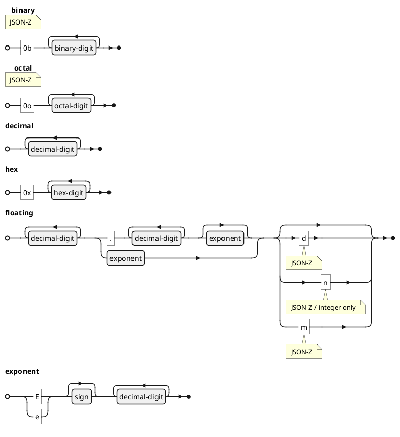
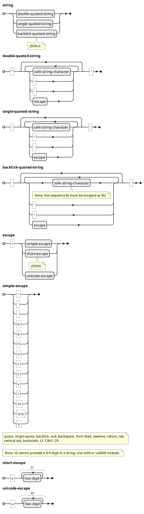
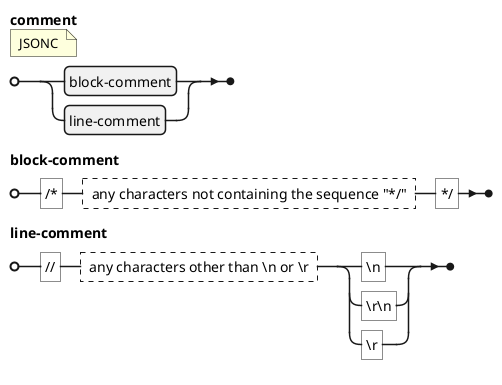
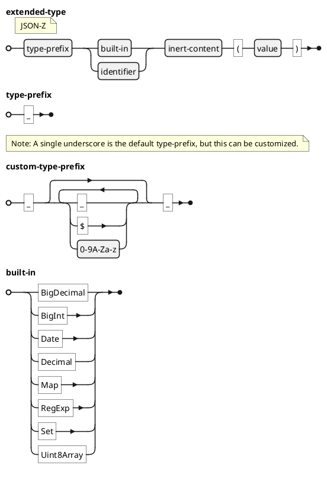

## JSON-Z Grammar

Features which exceed the JSON specification are flagged with the minimal feature set required for parsing them, in a hierarchy from least to most permissive: JSONC, JSON5, JSON-Z.

### Overview

### Basic character classes

### Numbers

### Simplified numbers

_This is what the number productions look like when the complications of underscore separators, leading/trailing decimal points, and implicit octal numbers are removed._

### Strings

### Comments

### Extended types

The form of an extended type mirrors that of a JavaScript function call, allowing these values to be parsed as JSONP, via the JavaScript `eval` function, or via the safer JavaScript `new Function(...)` technique, so long as evaluation takes place in a context where the named functions are defined.

The `JSONZ.globalizeTypeHandlers()` function can be used to establish such a context.

